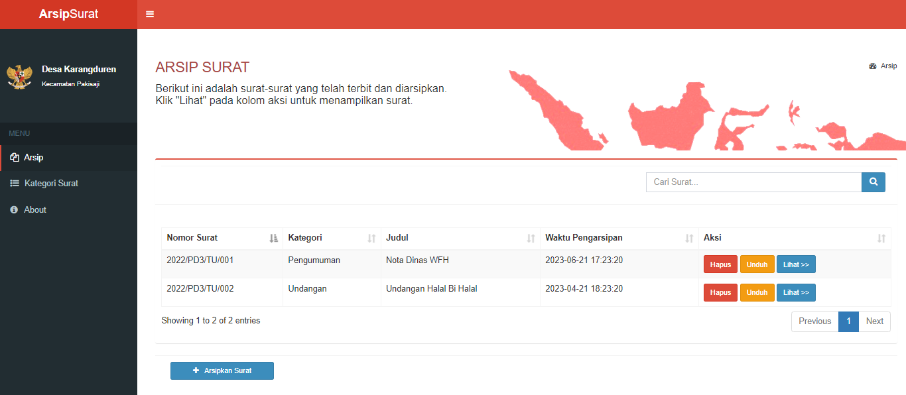
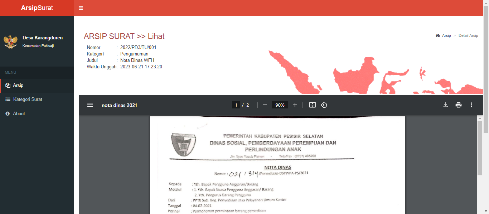

# Sistem Arsip Surat

Proyek ini dikembangkan sebagai bagian dari sertifikasi BNSP untuk mengelola arsip surat secara digital. Aplikasi ini memungkinkan pengguna untuk mengunggah, mengelola, dan mencari surat masuk dan keluar dengan mudah. Proyek ini dirancang untuk membantu organisasi dalam menjaga arsip surat dengan rapi dan terstruktur.

## Fitur
- Unggah surat dalam format PDF
- Pencarian surat berdasarkan kata kunci
- Kategori surat
- Pengunduhan surat

## Cuplikan Layar

### 1. Dashboard Arsip Surat

  

### 2. Detail Surat

  

